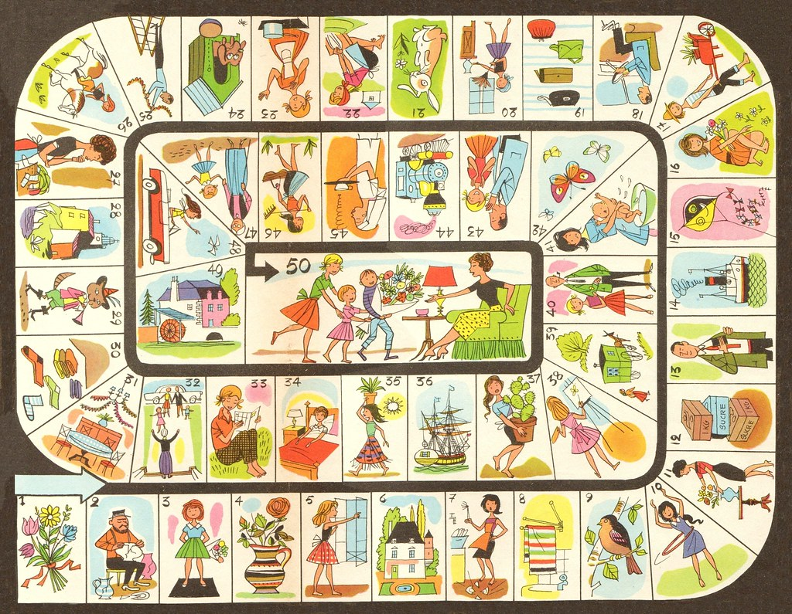
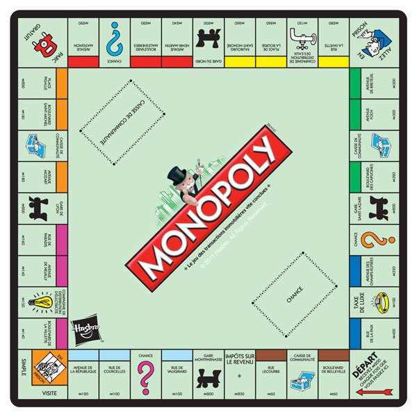

```{r setup, echo=FALSE}
knitr::opts_chunk$set(echo = FALSE,  fig.align = "center", warning = FALSE, error = FALSE, message = FALSE)
library(tidyverse)
library(plotly)
library(latex2exp)
library(kableExtra)
library(htmltools)
```

# Motivations {background-image="https://images.squarespace-cdn.com/content/v1/57d1f16d197aea6d03f08252/1473461284521-JRD0QNGA8YP01V2C3IAQ/Otter_schwimmend_Tusche.gif?format=2500w" background-size="cover" background-opacity="0.4"}


## Enjeux de la modélisation

- les processus permettent de modéliser une dynamique, celle d'une position, d'un état ou autre en fonction du temps 
- différents centres d'intérêt 
  + estimation des paramètres à partir d'observations
  + comportement en temps long du système (test in silico) 
  + détection de changement de comportement
  + etc.
- les **chaînes de Markov** s'inscrivent dans la catégorie des processus **aléatoires** avec la recherche d'une certaine forme de simplicité notamment sur les probabilités


## L'idée centrale : L'absence de mémoire

- un processus sera dit **de Markov** ou encore **markovien** si la position courante du système permet de déterminer entièrement les probabilités pour le futur, et ce indépendamment du passé
- par exemple, les jeux utilisant des dés comme le jeu de l'oie

{width=500 fig-align="center"}


## Autre exemple : Le Monopoly

{width=500 fig-align="center"}


## Quelques petites remarques

- les futures positions du pion ne dépendent que de sa position au début du tour sans avoir à tenir compte des tours précédents
- l'état du plateau (position des joueurs, maisons, hôtels, argent dans le parc gratuit) suit le même principe 
- cette hypothèse est très forte, une telle vision peut s'avérer trop simplificatrice en pratique, elle a cependant le mérite d'offrir une structure mathématique relativement simple

# Chaîne de Markov {background-image="https://images.squarespace-cdn.com/content/v1/57d1f16d197aea6d03f08252/1473461284521-JRD0QNGA8YP01V2C3IAQ/Otter_schwimmend_Tusche.gif?format=2500w" background-size="cover" background-opacity="0.4"}

## Eléments importants 

- sans plus de précision, une **Chaîne de Markov** est un processus en **temps discret** (par opposition au temps continu), c'est-à-dire que l'on peut numéroter chronologiquement les états successifs du système étudié $$(X_n)_{n\in\mathbb N}=(X_0,X_1,X_2,X_3,X_4,X_5,\dots)$$
- trois possibilités distinctes (par ordre de difficulté) pour le champ des possibles appelé **Espace d'états**
  + fini (ex : position d'un pion au monopoly)
  + infini dénombrable (ex : $\mathbb N$, $\mathbb Z$, $\mathbb Q$)
  + infini indénombrable (ex : $\mathbb R$, les intervalles réels)
- autre grande distinction pour une Chaîne de Markov
  + **homogène**, ex : le monopoly, que je démarre d'une même case au tour 1 ou 27, les chances de tomber sur telle ou telle autre case restent inchangées
  + **inhomogène**, par opposition


## Temps discret, espace d'états fini {.unnumbered}

- On s’intéresse au développement d’une forêt naturelle en région tempérée sur une parcelle en friche
(par exemple par abandon d’une zone cultivée ou suite à un incendie). Notre modèle simplifié comporte
3 états $S = \{h, a, f \}$. L’état $h$ est celui d’une végétation constituée d’herbes ou d’autres espèces pionnières ; l’état $a$
correspond à la présence d’arbustes dont le développement rapide nécessite un ensoleillement maximal et
l’état $f$ celui d’arbres plus gros qui peuvent se développer dans un environnement semi ensoleillé. Sur la parcelle on repère au sol un grand nombre de points (un millier) répartis sur un maillage régulier et on enregistre à intervalle de temps fixé (tous les 3 ans) l’état de la végétation en chacun de ces points (en choisissant celui des trois états qui est le plus proche).

```{tikz,fig.ext='svg', cache = TRUE,  out.width = '600px', fig.align = "center"}
\usetikzlibrary{patterns}
\begin{tikzpicture}[scale=.65,cap=round,>=latex,
V/.style = {circle, draw, white, fill=orange!70!yellow},
every edge quotes/.style = {auto, font=\tiny, sloped}]
    \node[V,draw, circle] (h) at (0,0) {\tiny $h$};
    \node[V,draw, circle] (a) at (4,0) {\tiny $a$};
    \node[V,draw, circle] (f) at (2,3) {\tiny $f$};
    \draw[->] 
        (a) edge [bend left = 15] node[below, midway, rotate = -45]{\tiny 0.4} (f) 
        (a) edge [bend left = 15] node[above, midway]{\tiny 0.1} (h) 
        (h) edge [bend left = 15] node[below, midway, rotate = 45]{\tiny 0.05} (f) 
        (h) edge [bend left = 15] node[above, midway]{\tiny 0.45} (a) 
        (f) edge [bend left = 15] node[above, midway, rotate = -45]{\tiny 0.1} (a) 
        (a)  edge [in=30,out=60,loop] node[above] {\tiny 0.5}   (a)
        (f)  edge [in=150,out=120,loop] node[above, near end, anchor = east] {\tiny 0.9}   (f)
        (h)  edge [in=150,out=120,loop] node[above] {\tiny 0.5}   (h)
 ;
\end{tikzpicture}
```


## Temps discret, espace d'états fini {.unnumbered}

```{r markov1, eval=TRUE, echo=FALSE, warning=FALSE, cache=TRUE}
horizon <- 50
lbda <- 1
P <- matrix(c(.5,.45,.05,.1,.5,.4,0,.1,.9), byrow = TRUE, ncol = 3)
S <- c("h", "a", "f") 
x <- 1
xn <- x
for (i in 1:horizon){
  randm <- rmultinom(1,1,P[xn,])
  xn <- which(randm == 1)
  x <- c(x,xn)
}
df <- data.frame(t = 0:horizon, state = S[x])
accumulate_by <- function(dat, var) {
  var <- lazyeval::f_eval(var, dat)
  lvls <- plotly:::getLevels(var)
  dats <- lapply(seq_along(lvls), function(x) {
    cbind(dat[var %in% lvls[seq(1, x)],], frame = lvls[[x]])
  })
  dplyr::bind_rows(dats)
}
df <- df %>% accumulate_by( ~ t)
p <- df %>% plot_ly(
    height = 500,
    x =  ~ t,
    y =  ~ state,
    frame = ~ frame,
    type = 'scatter',
    mode = 'markers'
  ) %>%
  add_trace(x =  ~ t,
    y =  ~ state,
    frame = ~ frame,
    type = 'scatter',
    mode = 'lines') %>% 
  layout(
    showlegend = FALSE,
    xaxis = list(
      zerolinecolor = 'ffff',
      zerolinewidth = 4,
      gridcolor = 'ffff',
      dtick = 1,
      title = "Nombre de cycles de 3 ans"
    ),
    yaxis = list(range = c(-.2,2.2),
      zerolinecolor = 'ffff',
      zerolinewidth = 4,
      gridcolor = 'ffff',
      dtick = 1,
      scaleanchor = "x",
      scaleratio = 1,
      title = "Etat de la forết"
    ),
    plot_bgcolor='#e5ecf6'
  ) %>%  animation_slider(
    visible = F
  )
p
```

- un point repère l'état de la forêt à chaque temps d'observation (tous les 3 ans), on lance un dé déséquilibré pour savoir où on tombe
- les données ici sont simulées, à terme on cherche à estimer ces probabilités pour savoir si un tel modèle peut expliquer en partie des observations réelles


## Temps continu, espace d'états fini {.unnumbered}

- par usage, on précise souvent **Chaîne de Markov en temps continu**, reprenons l'exemple précédent, où au lieu d'observer tous les 3 ans, on observerait à plus haute fréquence, pour ainsi enregistrer pratiquement en temps réel le changement d'état et l'instant du changement


```{r markov2, eval=TRUE, echo=FALSE, warning=FALSE, cache=TRUE}
########################
### horizon de l'étude
H <- 4
### pas de discrétisation temporelle
h <- .02
### position courante
Xt <- 1
### générateur
Q <- matrix(c(-3,1.8,1.2,2,-3,1,0,5,-5), ncol = 3, byrow = T)
### extraction des temps moyens de sortie
Tx <- -Q[Xt,Xt]
### génération du temps de sortie
rdmT <- rexp(1, Tx)
### tirage de la nouvelle position
rdmP <- rmultinom(1,1,Q[Xt,-Xt]/Tx)
rdmP <- which(rdmP == 1)
df <- data.frame(x = seq(0,rdmT,h), y = Xt, number = paste0("n=",0))
Xt <- (1:3)[-Xt][rdmP]
last_jump <- rdmT
n <- 0
while (last_jump<H){
  n <- n+1
  Tx <- -Q[Xt,Xt]
  rdmT <- rexp(1, Tx)
  rdmP <- rmultinom(1,1,Q[Xt,-Xt]/Tx)
  rdmP <- which(rdmP == 1)
  df2 <- data.frame(x = last_jump+seq(0,rdmT,h), y = Xt, number = paste0("n=",n))
  df <- rbind(df,df2)
  x <- last_jump+seq(0, rdmT, by = h)
  last_jump <- last_jump + rdmT
  Xt <- (1:3)[-Xt][rdmP]
}
S <- c("h", "a", "f") 
df <- df %>% mutate(state = S[y])
df <- df %>% accumulate_by( ~x)
p <- df %>% plot_ly(
  height = 500,
  x =  ~ x,
  y =  ~ state,
  frame = ~ frame,
  type = 'scatter',
  mode = 'lines',
  colors = rep("dodgerblue4", n+1)
) %>% 
  layout(showlegend = F,
    xaxis = list(
      zerolinecolor = 'ffff',
      zerolinewidth = 4,
      gridcolor = 'ffff',
      dtick = 1,
      title = "Temps"
    ),
    yaxis = list(range = c(-.2,2.2),
      zerolinecolor = 'ffff',
      zerolinewidth = 4,
      gridcolor = 'ffff',
      dtick = 1,
      scaleanchor = "x",
      scaleratio = 1,
      title = "Etat de la chaîne"
    ),
    plot_bgcolor='#e5ecf6'
  ) %>%  animation_slider(
    visible = F
  ) %>% animation_opts(frame = 10)
p
```


## Temps discret, espace d'états infini dénombrable {.unnumbered}

- considérons la marche aléatoire : à chaque étape la nouvelle position 
on fait un pas en avant avec probabilité $\tfrac12$ sinon un  pas en arrière
```{r markov3, eval=TRUE, echo=FALSE, warning=FALSE}
n <- 100
X <- c(0,cumsum(-1+2*rbinom(n = n, 1, .5)))
df <- data.frame(t = 0:n, X)
df <- df %>% accumulate_by(~t)
p <- df %>% plot_ly(
  height = 450,
  x =  ~ t,
  y =  ~ X,
  frame = ~ frame,
  type = 'scatter',
  mode = 'markers',
  colors = rep("dodgerblue4", n+1)
) %>% add_trace(x = ~t, y = ~ X, type = "scatter", mode = "lines") %>% 
  layout(showlegend = F,
    xaxis = list(
      zerolinecolor = 'ffff',
      zerolinewidth = 4,
      gridcolor = 'ffff',
      dtick = 5,
      title = "Temps"
    ),
    yaxis = list(range = c(-.2,2.2),
      zerolinecolor = 'ffff',
      zerolinewidth = 4,
      gridcolor = 'ffff',
      dtick = 5,
      scaleanchor = "x",
      scaleratio = 1,
      title = "Position"
    ),
    plot_bgcolor='#e5ecf6'
  ) %>%  animation_slider(
    visible = F
  )
p
```


## Temps discret, espace d'états infini indénombrable {.unnumbered}

- les exemples précédents étaient des chaînes homogènes : les règles du jeu ne changent pas au cours du temps et seule la position courante fixe les probabilités du futur
- ici, nous présentons un exemple où la prochaine position est décidée à la fois à partir de la position courante, mais aussi du temps : $\mathcal L(X_{t+1}|X_t) = \mathcal N(X_t, 1+\tfrac{10}t)$

```{r markov4, eval=TRUE, echo=FALSE, warning=FALSE}
set.seed(6166)
H <- 30
x <- 0.1
X <- x
for (i in 1:H){
  x <- rnorm(n = 1, mean = x, sd = i)
  X <- c(X,x)
}
df <- data.frame(t = 0:H, X)
df <- df %>% accumulate_by(~t)
p <- df %>% plot_ly(
  height = 400,
  x =  ~ t,
  y =  ~ X,
  frame = ~ frame,
  type = 'scatter',
  mode = 'markers'
) %>% 
  add_trace(x =  ~ t,
  y =  ~ X,
  frame = ~ frame,
  type = 'scatter',
  mode = 'lines') %>% 
  layout(showlegend = F,
    xaxis = list(
      zerolinecolor = 'ffff',
      zerolinewidth = 4,
      gridcolor = 'ffff',
      title = "Temps"
    ),
    yaxis = list(
      zerolinecolor = 'ffff',
      zerolinewidth = 4,
      gridcolor = 'ffff',
      scaleratio = 1,
      title = "Etat de la chaîne"
    ),
    plot_bgcolor='#e5ecf6'
  ) %>%  animation_slider(
    visible = F
  )
p
```


## Temps continu, espace d'états infini indénombrable  {.unnumbered}

```{r markov5, eval=TRUE, echo=FALSE, warning=FALSE}
h <- .01
n <- 500
hh <- sqrt(h)
X <- c(0, cumsum(rnorm(n, 0, hh)))
df <- data.frame(t = h*(0:n), X)
df <- df %>% accumulate_by(~t)
p <- df %>% plot_ly(
  x =  ~ t,
  y =  ~ X,
  frame = ~ frame,
  type = 'scatter',
  mode = 'lines'
) %>% 
  layout(showlegend = F,
    xaxis = list(
      zerolinecolor = 'ffff',
      zerolinewidth = 4,
      gridcolor = 'ffff',
      title = "Temps"
    ),
    yaxis = list(
      zerolinecolor = 'ffff',
      zerolinewidth = 4,
      gridcolor = 'ffff',
      scaleratio = 1,
      title = "Etat de la chaîne"
    ),
    plot_bgcolor='#e5ecf6'
  ) %>%  animation_slider(
    visible = F
  )%>% animation_opts(frame = 50,        # durée de chaque frame en ms
  transition = 0,    # durée de la transition
  easing = "linear")
p
```

# Chaîne de Markov à espace d'états fini {background-image="https://images.squarespace-cdn.com/content/v1/57d1f16d197aea6d03f08252/1473461284521-JRD0QNGA8YP01V2C3IAQ/Otter_schwimmend_Tusche.gif?format=2500w" background-size="cover" background-opacity="0.4"}


## Un peu de formalisme

>### Définition : 
> une **chaîne de Markov** $(X_n)_{n\in\mathbb N}$ sur un **espace d'états fini** $E$ est une suite de variables aléatoires telles que
$\forall i_{n+1},i_n,i_{n-1},\dots,i_0\in E,$ 
$$\mathbb P(X_{n+1}= i_{n+1}|X_{n}= i_{n},X_{n-1}= i_{n-1},\dots,X_0=i_0)=\mathbb P(X_{n+1}= i_{n+1}|X_{n}= i_{n}),$$

- c'est la traduction du principe que le futur ne dépend que de la position courante
- cette propriété est appelée **Propriété de Markov faible**, la version forte remplace l'instant générique $n$ par un **temps d'arrêt** $T$, une variable aléatoire possédant certaines propriétés de compatibilité


## Chaîne homogène

>### Définition : 
> une chaîne de Markov $(X_n)_{n\in\mathbb N}$ sur un espace d'états fini $E$ est dite **homogène** si
$$\mathbb P(X_{n+1} = j|X_n=i)=\mathbb P(X_{1} = j|X_0=i)=p_{ij}$$

- autrement dit les **probabilités de transition** sont constantes au cours du temps
- un exemple : le monopoly
- un contre-exemple : marche aléatoire sur $E=\{0,1\}$ avec 
$$\mathbb P(X_{n+1} =1|X_n=1)=\tfrac1n, \quad \mathbb P(X_{n+1} =1|X_n=0)=\tfrac1n, $$
- en pratique l'homogénéité permet de modéliser bon nombre de situations et surtout d'estimer les paramètres du modèle
- par la suite nous travaillerons dans le cadre de chaînes homogènes !


## Matrice de passage
>### Définition : 
> la **matrice de passage** $P$ d'une chaîne de Markov $(X_n)_{n\in\mathbb N}$ homogène sur un espace d'états fini $E$ est la matrice dont les coefficients sont les $p_{ij}$

- exemple : retour au développement d'une forêt naturelle, il s'agit d'une Chaîne de Markov homogène sur l'espace d'états $S = \{h, a, f \}$

$$P=\begin{pmatrix}0.5 &0.45 &0.05\\0.1 &0.5 &0.4\\0 &0.1 &0.9\end{pmatrix}$$
```{tikz 2e, fig.ext='svg', cache = TRUE,  out.width = '350px', fig.align = "center"}
\usetikzlibrary{patterns}
\begin{tikzpicture}[scale=.65,cap=round,>=latex,
V/.style = {circle, draw, white, fill=orange!70!yellow},
every edge quotes/.style = {auto, font=\tiny, sloped}]
    \node[V,draw, circle] (h) at (0,0) {\tiny $h$};
    \node[V,draw, circle] (a) at (4,0) {\tiny $a$};
    \node[V,draw, circle] (f) at (2,3) {\tiny $f$};
    \draw[->] 
        (a) edge [bend left = 15] node[below, midway, rotate = -45]{\tiny 0.4} (f) 
        (a) edge [bend left = 15] node[above, midway]{\tiny 0.1} (h) 
        (h) edge [bend left = 15] node[below, midway, rotate = 45]{\tiny 0.05} (f) 
        (h) edge [bend left = 15] node[above, midway]{\tiny 0.45} (a) 
        (f) edge [bend left = 15] node[above, midway, rotate = -45]{\tiny 0.1} (a) 
        (a)  edge [in=30,out=60,loop] node[above] {\tiny 0.5}   (a)
        (f)  edge [in=150,out=120,loop] node[above, near end, anchor = east] {\tiny 0.9}   (f)
        (h)  edge [in=150,out=120,loop] node[above] {\tiny 0.5}   (h)
 ;
\end{tikzpicture}
```

## Utilisation de la matrice de passage

- **remarque importante** : la $i^e$ ligne de la matrice $P$ fournit toutes les probabilités relatives à la sortie de l'état $i$, par conséquent
$$\sum_{j} p_{ij}=\sum_{j} \mathbb P(X_{n+1}=j|X_n = i)=1$$

- les puissances de la matrice permettent d'obtenir toutes la loi du processus sachant la position initiale, par exemple $$(P^2)_{i,j} =  \mathbb P(X_{n+2}=j|X_n = i) =  \mathbb P(X_{2}=j|X_0 = i)$$

- si la loi de la position initiale est donnée par le vecteur ligne $\mu = (\mathbb P(X_0)=i)_{i\in E}$, alors la **loi marginale** de $X_n$ est fournie par le vecteur ligne  
$\mu P^n$ autrement dit :
$$\mathbb P(X_n=i) = (\mu P^n)_i$$


## Des exemples et des remarques {.unnumbered}

- pour le monopoly, la seule position initiale possible est la case départ, si on numérote les états, on a alors $$\mu_1=\mathbb P(X_0=1)=1$$ et tous les autres $\mu_i$ sont nuls
- dans l'exemple de forestation
  + l'observation d'un cas donné permet de régler également la distribution de départ 
  + si l'on travaille sur un grand nombre de cas, on se retrouve alors avec une distribution basée sur la représentation initiale
  + reprenons la matrice associée et fixons $\mu$ correspondant à l'état initial $h$

$$P=\begin{pmatrix}0.5 &0.45 &0.05\\0.1 &0.5 &0.4\\0 &0.1 &0.9\end{pmatrix}, \quad \mu = \begin{pmatrix}1 &0 &0\end{pmatrix}$$


## Des exemples et des remarques {.unnumbered}

- la formule des probabilités totales permet d'avoir
$$\begin{array}{ll}
\mathbb P(X_1=h)=\mathbb P(X_1=h|X_0=h)\mathbb P(X_0=h)+\mathbb P(X_1=h|X_0=a)\mathbb P(X_0=a)+\mathbb P(X_1=h|X_0=f)\mathbb P(X_0=f)\\
\mathbb P(X_2=h)=
\mathbb P(X_2=h|X_1=h)\mathbb P(X_1=h)+\mathbb P(X_2=h|X_1=a)\mathbb P(X_1=a)+\mathbb P(X_2=h|X_1=f)\mathbb P(X_1=f)\end{array}$$

```{r proba totales, echo=TRUE, eval=TRUE}
P = matrix(c(0.5 ,0.45 ,0.05,0.1 ,0.5 ,0.4,0 ,0.1 ,0.9), byrow= TRUE, ncol = 3)
mu <- matrix(nrow = 1, c(1,0,0))
mu%*%P; mu%*%P%*%P
```


## Classification des états

- notre but consiste essentiellement par la suite à savoir quand il sera simple de deviner le comportement en temps long des chaînes
- quand $n$ est très grand, il n'est pas forcément raisonnable de calculer les puissances de la matrice
- il faut donc identifier les situations qui nous permettront d'extrapoler le comportement de la chaîne en temps long à partir de la structure de la matrice de passage
- plusieurs situations
  + des états dont on ne sort plus une fois rendu
  + des états qu'on ne verra plus si on attend suffisamment longtemps
  + des états qui reviennent tout le temps 
  

## D'un état à un autre

>### Définition : 
> un état $j$ est  **accessible** à partir de l'état $i$ s'il existe un entier $n$ tel que $$(P^n)_{i,j}>0.$$
Deux états **communiquent** si chacun est accessible à partir de l'autre. Si tous les états d'une chaîne communiquent entre eux, elle est dite **irréductible**.

- dit autrement, $j$ est accessible à partir de $i$  s'il existe un chemin de probabilité positive qui permet en partant de l'état $i$ de se rendre en $j$, s'ils communiquent on peut échanger leur rôles, et si la chaîne est irréductible, on peut toujours trouver un chemin de probabilité non-nulle d'un état à n'importe quel autre


## Etat absorbant

>### Définition : 
>un état $i$ est dit **absorbant** si $$p_{ii} = 1,$$ autrement dit la chaîne reste coincée dans cet état pour tous les instants suivants.  Si pour chaque état d'une chaîne il existe un  état absorbant accessible depuis cet état, la chaîne est dite **absorbante**.

- exemple :  un ivrogne erre le long de la rue qui mène de chez lui à son bar préféré, il y a trois carrefours à traverser mais une fois sur 2, il fait demi-tour quand il arrive à un carrefour. S'il arrive au bar ou chez lui il y passera la nuit. 

## Comportement limite des chaînes absorbantes

- on peut démontrer qu'une chaîne absorbante finira dans un état absorbant avec probabilité 1
  + si on numérote en dernier les états absorbants, alors la matrice $P$ peut se décomposer par blocs $$P=\begin{pmatrix}Q&R\\0 &I\end{pmatrix}$$
  + on démontre alors que 
    * $\lim_{n\to\infty} Q^n=0$
    * $I-Q$ est inversible
    * $\lim_{n\to\infty}P^n=\begin{pmatrix}0&(I-Q)^{-1}R\\0 &I\end{pmatrix}$
    * l'élément $((I-Q)^{-1})_{ij}$ donne l'espérance du nombre de passages en $j$ partant de l'état $i$ 

## Calculs sur exemple {.unnumbered}
::::{.columns}
:::{.column width="50%"}
- pour notre ivrogne, on présente la matrice en numérotant les 3 carrefours par 1,2 et 3 (du bar vers chez lui), le bar par 4 et sa maison par 5
$$P = \begin{pmatrix}0&\frac12&0&\frac12&0\\\frac12 &0 &\frac12 &0&0\\ 0&\frac12&0&0&\frac12\\0&0&0&1&0\\0&0&0&0&1
\end{pmatrix}=\begin{pmatrix}Q&R\\0&I\end{pmatrix}$$
avec
$$Q= \begin{pmatrix}0&\frac12&0\\\frac12 &0 &\frac12 \\ 0&\frac12&0
\end{pmatrix},\quad R=\begin{pmatrix}\frac12&0\\0&0\\ 0&\frac12
\end{pmatrix}$$
:::
:::{.column width="50%"}
- par le calcul, on obtient 
$$(I-Q)^{-1}=\begin{pmatrix}\frac32 &1&\frac12\\1&2&1\\\frac12&1&\frac32\end{pmatrix},$$ 
- ainsi
$$(I-Q)^{-1}R=\begin{pmatrix}\frac34&\frac14\\\frac12&\frac12\\\frac14&\frac34\end{pmatrix}$$

:::
::::
## Etat récurrent et état transient

- Notons $T_i$ le temps qu'il faut à une chaîne pour arriver en $i$ :$$T_i=\min \lbrace n\geq 1\colon X_n=i \rbrace$$
(par convention $\min\emptyset = +\infty$, le temps est dit infini quand la chaîne n'arrive jamais en $i$)
- si la chaîne est partie de $i$, le temps $T_i$ est le premier temps de retour en $i$

>### Définition : 
> un état $i$ est **récurrent** si partant de $i$ le temps de retour est fini, plus précisément si : $$\mathbb P(T_i < +\infty | X_0=i)=1,$$ sinon il est dit **transient**. Une chaîne est dite **récurrente** (respectivement **transiente**) si tous ses états sont récurrents (respectivement transients.)

- Important : il n'existe pas de chaîne transiente sur un espace d'états fini mais on en parle ici car toutes ces définitions restent valides lorsque $E$ est infini dénombrable

## Propriétés de la récurrence et de la transience
- notons $N_i$ la variable qui compte le nombre de passages dans l'état $i$ de la chaîne

>### Propriétés 
- si un état $i$ est récurrent, alors $\mathbb P(N_i=+\infty|X_0=i)=1$ et $\sum_n (P^n)_{ii}=+\infty$
- si un état $i$ est transient, alors si la chaîne part de $i$, la variable $N_i$ suit une loi géométrique de paramètre $\mathbb P(T_i<+\infty|X_0=i)$, de plus $\sum_n (P^n)_{ii}<+\infty$ et pour tout état $j$ $\lim_{n\to\infty}(P^n)_{ji}=0$
- si $j$ communique avec l'état récurrent $i$ (resp. transient), alors $j$ est récurrent (resp.transient), on parle ainsi de **classe récurrente** (resp. **classe transiente**) pour désigner un sous-ensemble d'états tous communiquants et récurrents (resp.transients) 


## What else ?

- résumons : 
  + la chaîne est absorbante, on sait ce qu'il se passe
  + sinon, seuls les états récurrents ont une chance d'apparaître en temps long
- l'objectif, déterminer une loi limite $\pi =(\pi_i)_{i\in E}$ qui pour chaque état $i$ approche la probabilité de se situer en $i$ en temps long :

$$\pi_i = \lim_{n\to\infty}\mathbb P(X_n = i) = \lim_{n\to\infty}(\mu P^n)_i$$
par exemple, pour le monopoly, la probabilité après un grand nombre de déplacements de tomber sur une case donnée serait du même ordre quel que soit ce nombre

- cette mesure limite chargera des états récurrents accessible depuis les points de départ possibles


## Dernier détail à régler

- il reste un détail à régler, le fait que les états communiquent avec le point de départ et soient récurrents semble nécessaire pour établir cette probabilité, seulement une situation simple  permet de comprendre que ce n'est pas suffisant 
$$P=\begin{pmatrix}0&0.5&0&0.5\\0.5&0&0.5&0\\0&0.5&0&0.5\\0.5&0&0.5&0 \end{pmatrix}$$
- par le calcul, on montre
$$P^2=\begin{pmatrix}0.5&0&0.5&0\\0&0.5&0&0.5\\0.5&0&0.5&0\\0&0.5&0&0.5 \end{pmatrix},\quad P^3=P$$
ainsi pour revenir en un même état, il faut réaliser un nombre pair d'étapes !


## Périodicité

- rappel (ou pas) : le PGCD d'un ensemble d'entiers est le plus grand diviseur commun de tous les entiers de l'ensemble considéré :
$$PGCD(4,6,8)=2,\quad PGCD(36,96,48,24)=12,\quad PGCD(96,48,24)=24$$

>### Définition : 
>la **période** d'un état $i$ est donnée par
$$d(i)=PGCD\big(n\geq 1\colon (P^n)_{ii}>0\Big)$$
si $d(i)\geq 2$, l'état est **périodique** de période $d(i)$ sinon (lorsque $d(i)=1$) l'état est dit **apériodique**. Une chaîne **apériodique** est une chaîne dont tous les états sont apériodiques.

- par exemple :   
$P = \begin{pmatrix}0&0.5&0.5\\0.5&0&0.5\\0.5&0.5&0\end{pmatrix}$


## Le candidat

- pour comprendre que celui-ci n'est pas sorti du chapeau essayons de dégager des leçons si : $$\pi = \lim_{n\to\infty}\mu P^n$$
- en multipliant par $P$ à droite dans les deux membres
$$\begin{array}{ll}\pi P&= \left(\displaystyle\lim_{n\to\infty}\mu P^n\right)P=\lim_{n\to\infty}\mu P^{n+1}\\&= \pi\end{array}$$

- il faut donc piocher dans les solutions de l'équation $\pi P=\pi$

>### Définition : 
>une loi de probabilité sur $E$ est dite **invariante** ou **stationnaire** pour une chaîne de matrice de transition $P$ si elle est solution de $$\pi P=\pi.$$


## Conséquences 

>### Propriété : 
>si $\pi$ est une loi stationnaire et si $i$ est un état transitoire, alors $\pi_i=0$

>### Théorème : 
>tout chaîne de Markov homogène sur espace d'états fini admet au moins une loi de probabilité stationnaire. Lorsque la chaîne est irréductible cette loi est unique et $$\pi_i=\frac1{\mathbb E[T_i|X_0=i]}>0.$$ Enfin, si la chaîne est à la fois **irréductible et apériodique** alors la matrice $P^n$ converge vers la matrice dont toutes les lignes sont égales à l'unique loi stationnaire $\pi$. Ainsi quelle que soit la loi initiale
$$\lim_{n\to+\infty}\mathbb P(X_n=i)=\pi_i$$


## Premier bilan

<!-- - de ce que l'on vient de dire le cas idéal est une chaîne de Markov homogène sur espace d'états fini, récurrente et apériodique pour obtenir la convergence de la loi de $X_n$ vers $\pi$ -->


>### Théorème ergodique et central limite
::::{.columns}
:::{.column width="50%"}
> si $(X_n)_{n\geq 0}$ est une chaîne de Markov irréductible et homogène sur espace d'états fini, alors pour toute fonction $f$ $$\mathbb P\left(\lim_{n\to\infty}\frac1n\sum_{k=1}^nf(X_k)=\sum_{i\in E}\pi_if(i)\right)=1.$$ 
:::
:::{.column width="50%"}
De plus, 
la variable $$\sqrt n\left(\lim_{n\to\infty}\frac1n\sum_{k=1}^nf(X_k)-\sum_{i\in E}\pi_if(i)\right)$$ converge en loi vers une variable de loi normale centrée réduite.
:::
::::

- à défaut d'avoir la loi directement de $X_n$, on reste en mesure d'évaluer une quantité moyenne sur la loi stationnaire (très utile en pratique)
- par exemple, considérons la fonction $f$ qui associe 1 à $i$ et 0 à tous les autres états, alors
$\frac1n\sum_{k=1}^nf(X_k)$ correspond à la fréquence de passage en $i$ et sa limite est $\pi_i$
- si elle est périodique, que faire ? la probabilité invariante est unique, et fournit les espérances de temps de retour, forcément positives


## Au final 

- lorsque l'espace d'états est fini et que la chaîne est homogène, la loi de $X_n$ est donnée par $\mu P^n$, où $\mu$ est un vecteur ligne donnant les probabilités pour la position initiale (loi de  $X_0$), et $P$ la matrice de transition de coefficients $p_{ij}=\mathbb P(X_{n+1}=j|X_n=i)=\mathbb P(X_1=j|X_0=i)$
- les états sont transients ou récurrents suivant s'ils apparaitront un nombre fini de fois ou non
- certains états récurrents sont absorbants, lorsqu'il y en a, la chaîne finit par y échouer
- si on démarre dans un état récurrent, on restera dans la classe récurrente de cet état
- si on démarre dans un état transient, on quittera la classe transiente de cet état en un nombre fini d'étapes et on la quittera pour une classe récurrente que l'on ne quittera plus
- la chaîne possède au moins une probabilité invariante (solution de $\pi=\pi P$) 
- pour interpréter un probabilité invariante $\pi$, le plus simple est le cas de la chaîne irréductible, qui garantit l'unicité de $\pi$ et permet de calculer d'approcher des espérances de la loi stationnaire à partir de fréquences d'occupation des états
- le cas le plus lisible, est le cas irréductible apériodique, où là $\mu P^n$ converge vers $\pi$ quelle que soit la loi initiale

# Chaîne de Markov à espace d'états infini dénombrable {background-image="https://images.squarespace-cdn.com/content/v1/57d1f16d197aea6d03f08252/1473461284521-JRD0QNGA8YP01V2C3IAQ/Otter_schwimmend_Tusche.gif?format=2500w" background-size="cover" background-opacity="0.4"}


## Les changements

- même si l'on conserve ici le caractère homogène, la matrice $P$ est remplacée par une suite infinie à double indiçage $\mathcal P$
- l'infini fait naître des situations nouvelles; par exemple considérons une chaîne sur $\mathbb Z$, où $$p_{i,i} =\frac 16, \,p_{i,i+1}=\frac13,\,p_{i,i+2}=\frac12,$$ alors tous les états sont transients, et le processus tend vers l'infini, donc de nouveaux comportements possibles; il n'existe pas nécessairement d'état récurrent !
```{tikz,fig.ext='svg', cache = TRUE,  out.width = '600px', fig.align = "center"}
\usetikzlibrary{patterns}
\begin{tikzpicture}[cap=round,>=latex,
V/.style = {circle, draw, white, fill=orange!70!yellow},
every edge quotes/.style = {auto, font=\tiny, sloped}]
    \draw[very thick, color =orange!70!yellow] (-8,0) -- (8,0);
    \node[V,draw, circle, minimum size = 1cm] (h) at (0,0) { $i$};
    \node[V,draw, circle, minimum size = 1cm] (a) at (3.5,0) {$i+1$};
    \node[V,draw, circle, minimum size = 1cm] (f) at (7,0) {$i+2$};
    \node[V,draw, circle, minimum size = 1cm] (b)  at (-3.5,0) { $i-1$};
    \node[V,draw, circle, minimum size = 1cm] (c) at (-7,0) { $i-2$};
    \draw[->] 
        (h) edge [bend right = 15] node[below, midway]{$\tfrac13$} (a)          
        (h) edge [bend left = 15] node[above, midway]{$\tfrac12$} (f) 
        (h) edge [in=150,out=120,loop] node[above] { $\tfrac16$}   (h);
\end{tikzpicture}
```


- il va falloir détailler la classe des états récurrents pour distinguer deux comportements désormais possibles sur les temps de retour


## Deux types de récurrences


>### Définition : 
>un état est dit **positif** si $\mathbb E[T_i|X_0=i]< +\infty$ sinon il est **nul**.

>### Propriété : 
>un état est nul si et seulement si $\lim_{n\to\infty} (P^n)_{ii}=0.$

- les états transients sont forcément des états nuls par définition
- d'après le théorème sur les lois invariantes, si l'espace d'états est fini, tous les états récurrents sont positifs, c'est donc bel et bien une nuance apportée par l'infinité d'états
- on retrouve le principe de classes : **classe récurrente positive**, **classe récurrente nulle** et toujours **classe transiente**
- une chaîne de Markov irréductible sur espace d'états fini est récurrente positive 

## Exemple : la marche aléatoire sur $\mathbb Z$

- considérons une chaîne démarrant en 0, se déplaçant vers l'entier suivant avec probabilté $p$ et le précédent avec probabilité $1-p$ (on fait juste un pas en avant ou en arrière)
  + si $p=\frac12$, la chaîne est récurrente nulle
  + si $p\neq\frac12$, la chaîne est transiente

```{tikz,fig.ext='svg', cache = TRUE,  out.width = '600px', fig.align = "center"}
\usetikzlibrary{patterns}
\begin{tikzpicture}[cap=round,>=latex,
V/.style = {circle, draw, white, fill=orange!70!yellow},
every edge quotes/.style = {auto, font=\tiny, sloped}]
    \draw[very thick, color =orange!70!yellow] (-8,0) -- (8,0);
    \node[V,draw, circle, minimum size = 1cm] (h) at (0,0) { $i$};
    \node[V,draw, circle, minimum size = 1cm] (a) at (3.5,0) {$i+1$};
    \node[V,draw, circle, minimum size = 1cm] (f) at (7,0) {$i+2$};
    \node[V,draw, circle, minimum size = 1cm] (b)  at (-3.5,0) { $i-1$};
    \node[V,draw, circle, minimum size = 1cm] (c) at (-7,0) { $i-2$};
    \draw[->] 
        (a) edge [bend left = 15] node[below, midway]{$1-p$} (h)         
        (h) edge [bend left = 15] node[above, midway]{$p$} (a) 
        (f) edge [bend left = 15] node[below, midway]{$1-p$} (a)         
        (a) edge [bend left = 15] node[above, midway]{$p$} (f)
        (b) edge [bend left = 15] node[below, midway]{$1-p$} (c)         
        (c) edge [bend left = 15] node[above, midway]{$p$} (b)
        (h) edge [bend left = 15] node[below, midway]{$1-p$} (b)         
        (b) edge [bend left = 15] node[above, midway]{$p$} (h);
\end{tikzpicture}
```

## Retour sur la question posée par Erwan {.scrollable}

- la réponse était dans la question (on va dire que j'étais fatigué, en tout cas sincèrement désolé ! Je me suis perdu tout seul.), le théorème central limite s'appliquant effectivement ici alors la loi limite de $\tfrac{X_n}n$ est une loi normale centrée réduite, ce qui revient à dire  que pour $n$ grand $X_n$ suit approximativement une loi normale centrée mais de variance $\sigma^2n$ mais $X_n$ n'a pas de loi limite ! C'est exactement le but de la renormalisation dans le théorème central limite. Malgré tout même si la limite n'existe pas on dispose a minima d'un équivalent !  
- ci-dessous, on voit le phénomène d'aplatissement de la densité lorsque la variance est énorme, d'où l'image que je donnais 

```{r}
library(plotly)
x <- seq(-10, 10, by=.01)
lx <- length(x)
sig <- c(1,10,100,1000,10000)
ls <- length(sig)
normdst <- function(x,sig){
  f=dnorm(x, mean = 0, sd = sig)
  return(f)
}
z <- outer(x,sig,normdst)
z <- matrix(z, ncol=1)
df <- data.frame( x = x, b = rep(paste0(" = ", sig), each = lx), z = z)
normgf <- df %>% 
  plot_ly(x = ~x, y = ~z, hoverinfo = "text", showlegend = FALSE) %>% 
  layout(yaxis = list(title = "Densité"))
normgf <- normgf %>% 
  add_trace(frame = ~b, type = 'scatter', mode = 'lines', fill = 'tozeroy') %>%
  animation_opts(1000, easing = "elastic", redraw = FALSE) %>%
  animation_button(
    x = 1, xanchor = "right", y = 0, yanchor = "bottom"
  ) %>%
  animation_slider(
    currentvalue = list(prefix = "sigma ", font = list(color="orange")
    )
  )
normgf
```

- si elle n'admet pas de loi, on peut en effet obtenir la loi de $X_n$ de manière exacte comme Erwan le faisait remarquer. Pour l'obtenir, appelons $N_n$ le nombre de pas positif effectué, le nombre de pas dans l'autre direction est alors $n-N_n$, ainsi $X_n = N_n-(n-N_n)=2N_n-n$. La variable $N_n$ suit la loi binomiale $\mathcal B(n, 0.5)$, de variance $\tfrac n2$, ainsi la variance de $X_n$ est exactement $n$ qui tend vers l'infini (donc pas de loi limite). On peut malgré tout écrire 
$$\mathbb P(X_n=k)=\frac1{2^n}\binom{n}{\tfrac{n+k}2}$$
- la loi est représentée ci-dessous, un nombre sur 2 est de probabilité nulle,  en tout cas, on retrouve l'aplatissement de la loi (on notera que la probabilité la plus grande est de l'ordre de $6\times 10^{-32}$)
```{r}
x <- seq(-100, 100, by=1)
lx <- length(x)
n <- c(100, 1000,  10001)
ls <- length(n)
chaine <- function(x,n){
  if ((n+x)%%2==0){
  f=dbinom( (x+n)/2 , size = n, prob = .5)/2^n
  return(f)}else {f=0}
}
chaine <- Vectorize(chaine)
z <- outer(x,n,chaine)
z <- matrix(z, ncol=1)
df <- data.frame( x = x, b = rep(paste0(" = ", n), each = lx), z = z)
loi <- df %>% 
  plot_ly(x = ~x, y = ~z, hoverinfo = "text", showlegend = FALSE) %>% 
  layout(yaxis = list(title = "Probabilité"))
loi <- loi %>% 
  add_trace(frame = ~b, type = 'scatter', mode = 'markers') %>%
  animation_opts(1000, easing = "elastic", redraw = FALSE) %>%
  animation_button(
    x = 1, xanchor = "right", y = 0, yanchor = "bottom"
  ) %>%
  animation_slider(
    currentvalue = list(prefix = "n ", font = list(color="orange")
    )
  )
loi
```


## What's the difference ?

>### Théorème : 
> considérons une chaîne **irréductible récurrente** sur un espace d'états $E$ au plus dénombrable, il existe une solution $\nu = (\nu_i)_{i\in E}$ à $\nu \mathcal P= \nu$ (sans que ce soit nécessairement une probabilité, on peut avoir $\sum_{i\in E}\nu_i=+\infty$).
Si la chaine est  **irréductible récurrente positive**, il existe une unique loi de probabilité stationnaire $\pi$, donnée par
$$\pi_i=\frac1{\mathbb E[T_i|X_0=i]}.$$
Si  la chaine est  **irréductible récurrente nulle**, il n'existe pas de probabilité stationnaire.


## Théorèmes 

>### Théorème ergodique 
>si $(X_n)_{n\geq 0}$ est une chaîne de Markov **irréductible récurrente positive** (et homogène) sur espace d'états fini, alors pour toute fonction $f$ $$\mathbb P\left(\lim_{n\to\infty}\frac1n\sum_{k=1}^nf(X_k)=\sum_{i\in E}\pi_if(i)\right)=1.$$ 

>### Théorème de convergence vers la loi stationnaire
si la chaîne est **irréductible apériodique et récurrente positive** de mesure invariante $\pi$,
alors, pour toute mesure initiale $\mu$ et pour tout état $i$
$$lim_{n\to\infty}
\mathbb P(X_n = i) = \pi(i).$$


